# README.md

## Discription
- I was given the task of researching Number Plate OCR.
- find WPOD-Net of Number Plate Detect and Deep Text Reognition Benchmark of OCR, and tried to make one task by connecting the two.
- order of this project : Number plate Detect on Image and Text & Number Recognition of Detected Number Plate 

## PrePareded

- anaconda env
- requirements.txt
- clova AI → deep text recognition → trained weights (ex, .pth)
- wpod-net weights (ex, .h5 , .json)
- https://github.com/KavenLee/wpod_ocr/releases/tag/wpod
- Make Dir 'weights' and put the downloaded file in the Dir
- Directory with Image list
- Your Directory path put it in a variable 'dir_path'

## OCR Recognition Training

- train data, validation data (ex, image)
- train & val labelling data (ex, .txt)
- train & val data split using ocr_label.py & train_test_split.py
- Label (ex, {imagepath} \t {label} \n ) → a.jpg(\t)apple(\n)

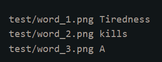

- cd d:\\Library\deep-text-recognition-benchmark
- using train.py, create-lmdb.py

## Detect Number Plate

- using wpod-net
- get high accuracy if only a car existed in image file.
- using openCV image
- using PIL Image on OCR

## Excution

- 'N' key   : next image
- 'P' key   : prev image
- 'ESC' key : program exit
- using a image
- success

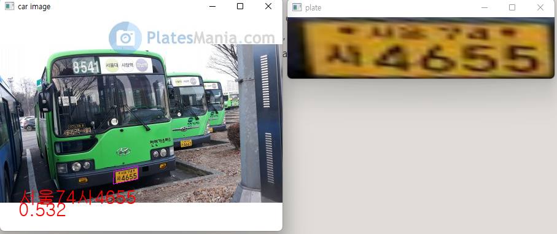

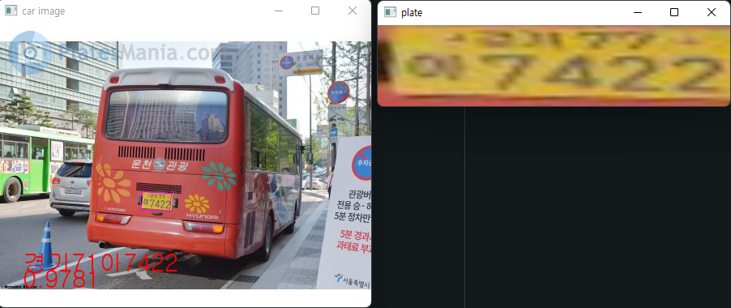

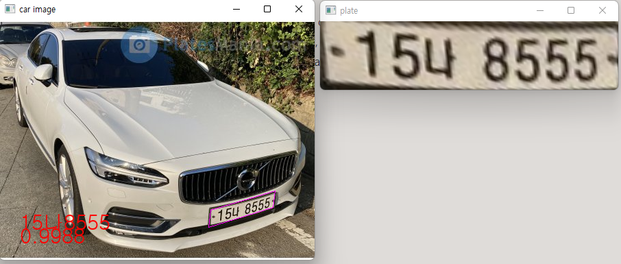

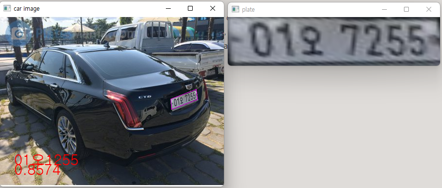

- Failed

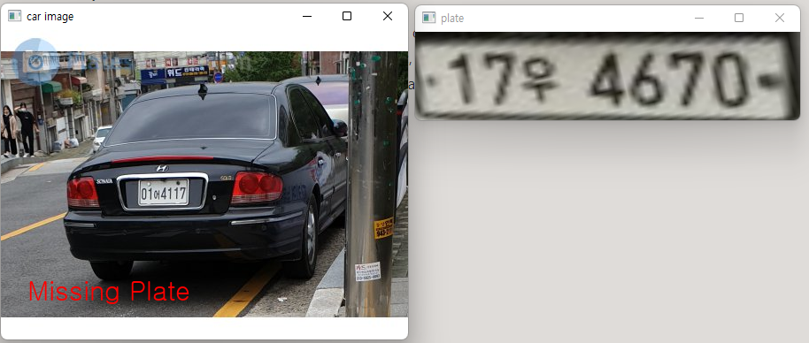

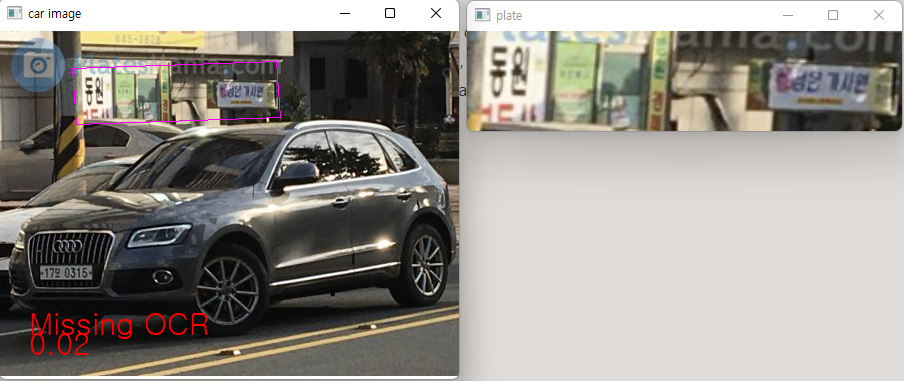

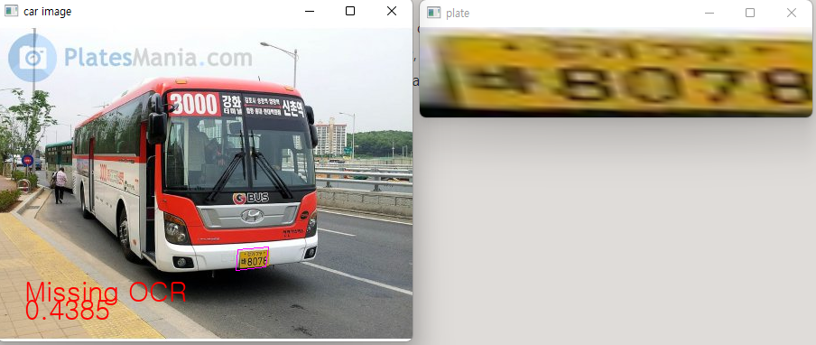

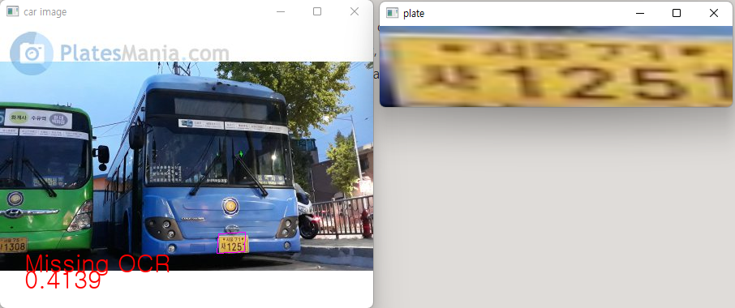

- using video

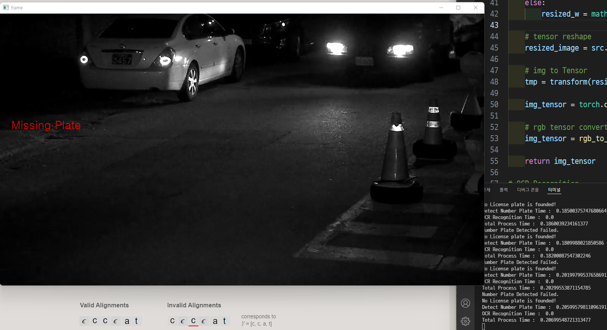

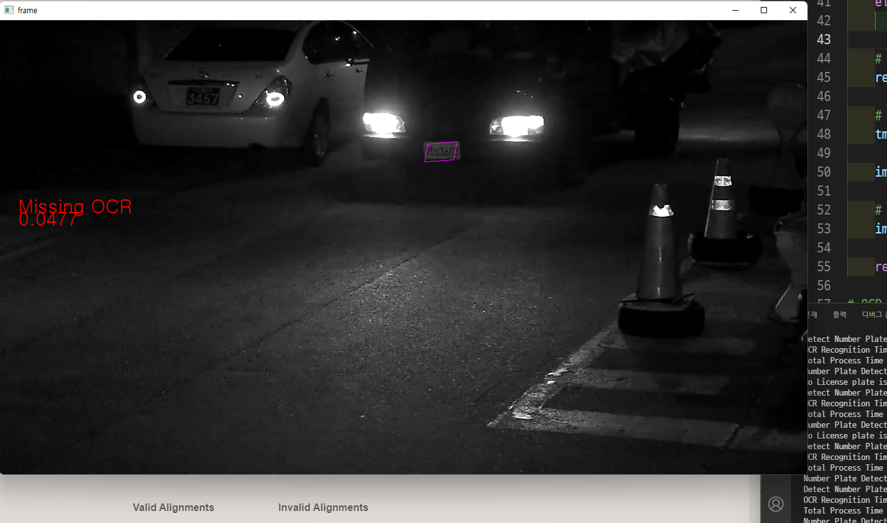

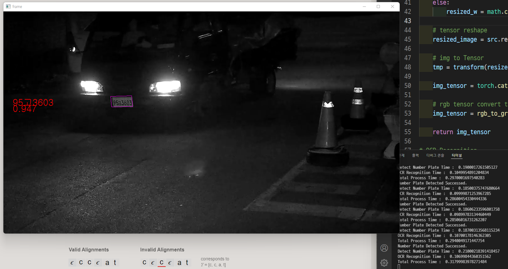

## Performance

- No GPU, Only CPU (OS : Windows)
    - Detect Number Plate time → Iamge : 100 ~ 180ms ,Video : 200ms
    - OCR Recognition time       →  Image : 50ms , Video : 80 ~ 100 ms
    - Total time → 200~300ms
- Using GPU on Jetson Xavier Nx(OS : Linux)
    - Detect Number Plate time → Image : 3 ~ 400ms
    - OCR Recognition time       → Image : 100~ 200ms
    - Total time → 400~600 ms

## Reference

[https://github.com/clovaai/deep-text-recognition-benchmark](https://github.com/clovaai/deep-text-recognition-benchmark)

[https://github.com/sameerbairwa/ANPR](https://github.com/sameerbairwa/ANPR)

[네이버 deep-text-recognition 모델을 custom data로 학습 & 아키텍쳐 분석](https://ropiens.tistory.com/35)
